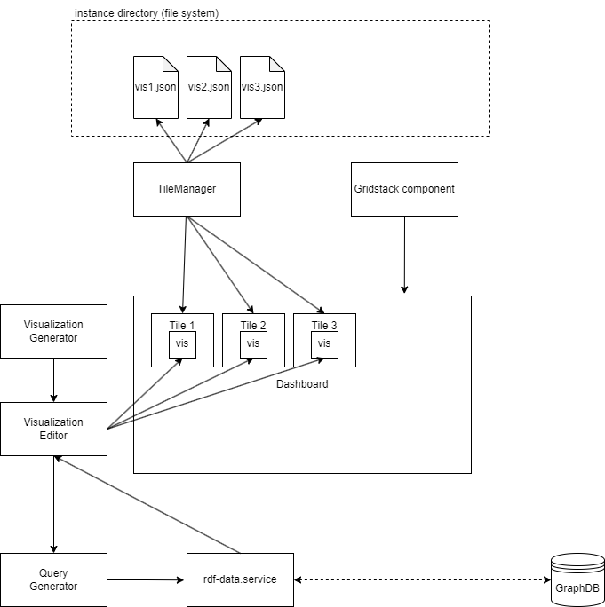
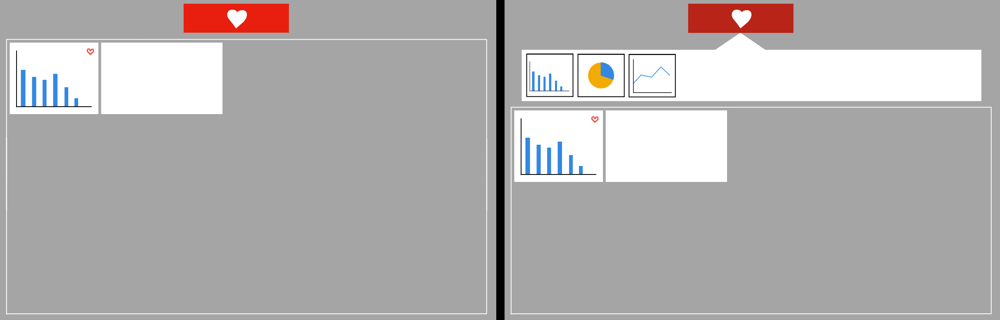

= Project Description
:toc: macro
:tocLevels: 3

[options="", cols="2h, 6"]
|===
|Project title
|Dashboard for Semantic Data 

|Term
|Winter term 2023/24

|Participants
|Zhiwei Zhan, Undine Stelter

|Supervision
|Dr.-Ing. Annett Mitschick, Dr.-Ing. Tom Horak, Sarah Alaghbari

|Course
|Team Project User Interface Engineering [KPUIE]
|===

toc::[]

== Introduction
Welcome to our project description for the development of a dashboard application designed to visualize semantic data. This project description will lay out our design decisions and implementation plans for the application. Furthermore, it is a living document and will undergo multiple revisions thoughtout the project. 

== Task description
The primary goal of this project is to develop a proof-of-concept prototype for a web-based dashboard application. The application's focus is to serve as a flexible visualization tool for semantic data. With it, the user will be able to create and customize visualizations and arrange them on a dashboard, both in an effort to facilitate data exploration. Additionally, the prototype is built with extensibility in mind, so new visualization types or customization options can be added in the future.

== Use Cases
In this section, we present an example use case for each of the four visualization types.

[cols="1h, 3"]
[[UC0010]]
|===
| ID | **<<UC0010>>**
| Visualization | Bar Chart
| Data to be visualized | The different skills listed in job postings "Polymechaniker" and how many of those job postings list each skill.
| Process | 
1. Count all Job Postings with "Polymechaniker" in their title +
2. List all skills associated with "Polymechaniker" Job Postings (distinct and only German names) +
3. Count the number of occurrences for each skill +
| Example queries | 
1. `SELECT (COUNT(*) AS ?postingCount) +
WHERE { +
    ?s rdf:type edm:JobPosting. +
    ?s edm:title ?title. +
    FILTER contains(?title, "Polymechaniker"). +
}` +
2. `SELECT distinct ?skillName +
WHERE {  +
    ?s rdf:type edm:JobPosting. +
    ?s edm:title ?title. +
    FILTER contains(?title, "Polymechaniker"). +
    ?s edm:hasSkill ?skill. +
    ?skill edm:textField ?skillName. +
    FILTER (lang(?skillName) = "de"). +
}` +
3. `SELECT ?skillName (COUNT(?s) AS ?occurrences) +
WHERE { +
    ?s rdf:type edm:JobPosting. +
    ?s edm:title ?title. +
    FILTER contains(?title, "Polymechaniker"). +
    ?s edm:hasSkill ?skill. +
    ?skill edm:textField ?skillName. +
    FILTER (lang(?skillName) = "de"). +
    FILTER (?skillName IN ("CNC-Schleifen"@de, "Steuerungskenntnisse"@de, "Selbstständigkeit"@de, "Qualitätsbewusstsein"@de, "Problemlösungsfähigkeit"@de, ...)) +
} +
GROUP BY ?skillName` +
| Notes | Since the total number of skills in the data set is quite large, the user should be prompted to select a specific job name to do this particular analysis for.
|===

[cols="1h, 3"]
[[UC0020]]
|===
| ID | **<<UC0020>>**
| Visualization | Pie Chart
| Data to be visualized | The distribution of Job Postings listed as fulltime over the entire dataset.
| Process | 
1. Count all Job Postings +
2. Count all Job Postings that are fulltime +
3. Count all Job Postings that are part time +
| Example queries | 
1. `SELECT (count(?s) AS ?fulltimeCount ) +
WHERE { +
?s rdf:type edm:JobPosting. +
?s edm:title ?title. +
}` +
2. `SELECT (count(?s) AS ?fulltimeCount ) +
WHERE { +
?s rdf:type edm:JobPosting. +
?s edm:title ?title. +
?s mp:isFulltimeJob "true"^^xsd:boolean. +
}` +
3. `SELECT (count(?s) AS ?fulltimeCount ) +
WHERE { +
?s rdf:type edm:JobPosting. +
?s edm:title ?title. +
?s mp:isFulltimeJob "false"^^xsd:boolean. +
}` +
| Notes | Since the isFulltimejob field can be missing, we shouldn't calculate the false count from the total and true counts.
|===

[cols="1h, 3"]
[[UC0030]]
|===
| ID | **<<UC0030>>**
| Visualization | Line Chart
| Data to be visualized | The number of Job Postings created between November 6 2023 and November 10 2023.
| Process | 
Count the job postings for each day.
| Example queries | 
`SELECT * +
WHERE { +
    ?s rdf:type edm:JobPosting. +
    ?s edm:title ?title. +
    ?s edm:dateCreated ?created. +
    FILTER (xsd:dateTime(?created) = xsd:dateTime("2023-11-06T00:00:00Z")). +
}` +
... +
`SELECT *  +
WHERE {  +
    ?s rdf:type edm:JobPosting. +
    ?s edm:title ?title. +
    ?s edm:dateCreated ?created. +
    FILTER (xsd:dateTime(?created) = xsd:dateTime("2023-11-10T00:00:00Z")). +
}` +
| Notes | We are still working on querying all counts in one query, similar to the skill names in <<UC0010>>.
|===

[cols="1h, 3"]
[[UC0040]]
|===
| ID | **<<UC0040>>**
| Visualization | Star Plot
| Data to be visualized | For multiple job names, compare how many of their Job Postings have a user-made selection of "soft skills" listed.
| Process | 
For each of the job names +
1. Count the total number of Job Postings +
2. Get the skill counts for the set of "soft skills" +
3. Divide each of the skill counts with the total number of Job Postings to "normalize" it to a number between 0 and 1 +
| Example queries | 
1. `SELECT (COUNT(*) AS ?postingCount) +
WHERE { +
    ?s rdf:type edm:JobPosting. +
    ?s edm:title ?title. +
    FILTER contains(?title, "Polymechaniker"). +
}` +
... +
`SELECT *  +
WHERE {  +
    ?s rdf:type edm:JobPosting. +
    ?s edm:title ?title. +
    ?s edm:dateCreated ?created. +
    FILTER (xsd:dateTime(?created) = xsd:dateTime("2023-11-10T00:00:00Z")). +
}` +
2. `SELECT ?skillName (COUNT(?s) AS ?occurrences) +
WHERE { +
    ?s rdf:type edm:JobPosting. +
    ?s edm:title ?title. +
    FILTER contains(?title, "Polymechaniker"). +
    ?s edm:hasSkill ?skill. +
    ?skill edm:textField ?skillName. +
    FILTER (lang(?skillName) = "de"). +
    FILTER (?skillName IN ("Teamfähigkeit"@de, "Kommunikation"@de, "Selbstständigkeit"@de, "Leitungsbereitschaft"@de, "Motivation"@de)) +
}`
| Notes | At this point in time, it is still unclear whether the star plots are on the same tile or each gets their own tile.
|===

== Requirement Specification
=== Functional Requirements
==== Required Functional Requirements

[options="header", cols="2h, 3, 12"]
|===
|ID
|Name
|Description

|[[FR0010]]<<FR0010>>
|Generate visualizations
a|
The user is able to choose out of four visualization types for each visualization the application generates. The visualization types are picked from the categories Evolution, Ranking and Part of a whole.

|[[FR0011]]<<FR0011>>
|Data selection
a|
The user is able to select which instance data is used to generate visualizations (<<FR0010>>).

|[[FR0012]]<<FR0012>>
|Domain limiting 
a|
The user is able to filter the instance data which is used to to generate visualizations (<<FR0010>>) by limiting the domain, e.g. by specifying a time frame for the data.

|[[FR0013]]<<FR0013>>
|Mapping customization (color)
a|
The user is able to customize the color scheme mapped onto the data when generating visualizations (<<FR0010>>).

|[[FR0014]]<<FR0014>>
|Data filtering
a|
The user is able to filter the instance data used to generate visualizations (<<FR0010>>) by selecting attributes, values or relationships from a list generated by the application.

|[[FR0015]]<<FR0015>>
|Visibility toggle
a|
The user is able to toggle the visibility of different values, e.g. displaying only certain skills out of a list of skills.

|[[FR0020]]<<FR0020>>
|Dashboard
a|
The app contains a dashboard, with each user-generated visualization being represented by a tile. The application supports up to 20 tiles at once without crashes. The number of tiles the user can generate is not limited.

|[[FR0021]]<<FR0021>>
|Arrange visualizations
a|
The user is able to arrange the tiles representing visualizations (<<FR0020>>) freely on the dashboard using a drag-and-drop system.

|[[FR0022]]<<FR0022>>
|Resizeable tiles
a|
The dashboard tiles can be resized freely by the user, in unit steps. The minimum tile size depends on the visualization type.

|[[FR0023]]<<FR0023>>
|Labeled visualizations
a|
Each visualizations on the dashboard incorporates labels appropriate for the visualization type, e.g. axis labels and color keys.

|[[FR0024]]<<FR0024>>
|Delete visualizations
a|
The user is able to delete visualizations by deleting the tile containing them.

|[[FR0030]]<<FR0030>>
|Database querying
a|
The application communicates with the SPARQL endpoint of an existing GraphDB database via premade SPARQL queries that are then configured by the user.

|[[FR0040]]<<FR0040>>
|Mouse support
a|
The application supports user interaction via both mouse and keyboard inputs, enabling users to navigate and select options using the mouse, while allowing text and numerical data entry through keyboard input in designated fields.

|[[FR0041]]<<FR0041>>
|Display Language
a|
The application's display language is English.
|===

==== Optional Functional Requirements
[options="header", cols="2h, 3, 12"]
|===
|ID
|Name
|Description

|[[FO0010]]<<FO0010>>
|Mapping customization (totals)
a|
The user is able to add totals and additive values when generating visualizations (<<FR0014>>).

|[[FO0011]]<<FO0011>>
|Mapping customization (grouping)
a|
The user is able to define groups of values when generating visualizations (<<FR0014>>).

|[[FO0012]]<<FO0012>>
|Custom titles
a|
The user is able to give custon titles to generated visualizations.

|[[FO0013]]<<FO0013>>
|Stashing visualizations
a|
The user is able to "stash" visualizations that are not needed at the moment, without having to delete them.

|[[FO0014]]<<FO0014>>
|Download visualizations
a|
The user is able to download visualizations or the means to re-generate them as a file. Such files can be uploaded into the program to re-generate the visualizations. Visualizations can be shared between users by sharing these files (e.g. via Email).

|[[FO0015]]<<FO0015>>
|Interactive Visualizations
a|
The user is able to interact with visualizations, e.g. adjust the portrayed time frame. These adjustments may alter the SPARQL query underlying the visualization. This does not include interaction between visualizations, e.g. brushing and linking techniques.

|[[FO0016]]<<FO0016>>
|Aspect Ratio Locking
a|
The user is able to lock the aspect ratio of a particular tile to prevent accidental resizing.

|[[FO0017]]<<FO0017>>
|User guidance (Filtering)
a|
The application offers the user guidance for selecting the data to be visualized (<<FR0012>>, <<FR0014>>), e.g. by displaying lists of available attributes for the user to select some or by displaying counts of instances affected by a filter.

|[[FO0020]]<<FO0020>>
|Touchscreen support
a|
The application's support for mouse and keyboard (<<FR0040>>) is extended by touchscreen support.

|[[FO0021]]<<FO0021>>
|German Language Support
a|
The application additionally offers German as a display language, with a switch to toggle between languages.
|===

=== Non-functional Requirements
[options="header", cols="2h, 3, 12"]
|===
|ID
|Name
|Description

|[[NF0010]]<<NF0010>>
|Interchangable dataset
a|
The application is able to generate visualizations for any semantic data set retrievable from a SPARQL Endpoint.

|[[NF0020]]<<NF0020>>
|Usability
a|
The application can be used without SPARQL knowledge and without extensive training.

|[[NF0021]]<<NF0021>>
|Reactiveness
a|
The application strikes a balance between minimizing user interface response times and maximizing the number of data points displayed at once.

|[[NF0030]]<<NF0030>>
|Extensibility
a|
The application is able to be extended easily, e.g. by adding more visualization types or by adding further customization options to existing visualization types.

|[[NF0031]]<<NF0031>>
|Readability
a|
The code should be readable and well documented to facilitate extensibility (<<NF0030>>).
|===

Our focus lies on the interchangability of the dataset, the application's extensibility and the responsiveness of the user interface.

== System Components
This section will detail the different components of the applications, our design considerations for each component and a our implementation goals, ranging from the minimum to the ideal version.

=== Visualization Generator/"Wizard"
General Rule: Immutable aspects of the visualization are picked in the Wizard, the rest is done in the Editor.

- a page with multiple sections that build onto another
- user clicks on "Forward to Editor" to navigate there
- its purpose is to guide the user through generating a visualization and help them explore the data
- first step: choosing the visualization type
- the further steps and their layout depend on the visualization type, to not overwhealm the user with potentially irrelevant options
- the user should be able to go back to change the visualization type without leaving the Wizard page
- being able to go back has implications for the layout of further steps, so this has to be explored thoroughly

[cols="2h, 12"]
|===
|Minimum
a|
- the same data selection process for all visualization types
- text and number fields for data pre-selection, without feedback for the user as to how those filters impact the data set
- user can choose which property to map to the axes (<<FR0011>>)
|Implementation Goal
a|
- icons for the visualization types
- data pre-selection steps depend on the visualization type
- data preview in a table when the user puts in a filter
|Ideal
a|
- presets for the user to choose from and adjust
- user guidance for selecting the right filters, e.g. through recommendations (<<FO0017>>)
|===

=== Visualization Editor
- user gets to the Editor by completing the Wizard with "Forward to Editor"
- when clicking the "Edit" button in a tile (the pencil symbol), they also get taken to the Editor
- user can choose the attributes to visualize and how they are mapped
- user can also choose the time frame to visualize, if applicable
- this is a lot of settings, so related settings should be grouped together
- the settings made here are saved in a config file (JSON file, human-readable)
- there is an "Apply changes" button and once that is pressed, a SPARQL query is generated, sent to the database and the visualization is generated (and visible on the side)

[cols="2h, 12"]
|===
|Minimum
a|
- user assembles a SPARQL query with assistance (e.g. using dropdown menus) 
- settings and query parameters are saved in a config file
- when pressing "Apply changes", the editor is closed and a tile containing the visualization is generated (<<FR0010>>)
- user can apply/change filters to define the range of the axes (<<FR0012>>)
- user can choose which attributes to display as data points (<<FR0011>>)

|Implementation Goal
a|
- the user only chooses options, no directly visible SPARQL query
- user can choose from a set of predefined color schemes (<<FR0013>>)
- visualization to be generated is visible on one half of the editor page and pressing "Apply changes" re-loads the image
- related settings are grouped together
- user can give custom titles to visualizations (<<FO0012>>)
- include a "Delete" button here, in addition to the "Delete" button on the dashboard tile
|Ideal
a|
- user can do certain adjustments directly on the visualization (e.g. axis label is a dropdown menu with a selection of attributes) (<<FO0015>>)
- more mapping options (<<FO0010>>, <<FO0011>>)
- user can define a custom color scheme (<<FR0013>>)
- user can save color schemes and has them available for other visualizations
|===

=== Dashboard
- anticipated challenge: reload the image in the tile once the user has changed the size, look out that it doesn't get too slow
- performance overall will likely be an issue here
- use inbuilt gridstack.js functionality
- the page can expand downwards as needed, no limited grid size
- tiles have a minimum tile size depending on the visualization type

[cols="2h, 12"]
|===
|Minimum
a|
- a dashboard with tiles (<<FR0020>>)
- tiles are resizeable and draggable (<<FR0021>>, <<FR0022>>)
- the user can delete tiles (<<FR0024>>)
- Application asks user, if they really want to delete the tile, to avoid accidental deletion
|Implementation Goal
a|
- "inventory" for favorited tiles, so the user can stash tiles away (<<FO0013>>)
- user can mark tiles as favorites by clicking a "Favorite" button
- favorited tiles are marked
- long tile titles are handled appropriately, e.g. by scaling down the font or shortening them
|Ideal
a|
- a auto-align or auto-format button (e.g. instantly making a tile take up half the screen)
- the user can directly interact with visualizations, e.g. adjusting the portrayed time frame, without going to the editor page (<<FO0015>>)
|===

==== Tile Interaction
One of the ideas we found really interesting is the concept of combining visualizations by combining the tiles containing them. One of the more obvious examples for this would be to drag two bar charts on top of each other to create a stacked bar chart:

In the concept drawing, the edges of the two tiles are hightlighted, indicating that it is possible to combine them. These edge highlights would only appear, if the user moves one tile closer to another. Alternatively, the user could click and hold one tile and all compatible tiles get hightlighted. Finding rules for combineability seemed trivial at first, but with the possibility of different axis domains, units and even visualization types, this idea quickly went beyond the scope of this project.  

Another interesting aspect of this tile interaction is how to communicate combineability to the user, especially if there is more than one way of combining two tiles (like combining two bar charts at the side to have the bars next to each other). Different colored edge highlights or a half-transparent new tile with a preview of the end result could help distinguish the different combination methods. If the user tries to combine two tiles which are incompatible, the reason of this incompatibility should be outputted to the user. Since the user moves tiles per drag and drop, the output shouldn't interfere with their action, so a toast message would be preferrable to a popup in the middle of the screen. 

One could also add a "combination mode" the user has to switch on, to prevent accidental combination of tiles (especially if combining tiles removes them from the grid and only leaves the resulting tile). The mode being activated should also be visually indicated, to avoid confusion. This "combination mode" could then also display a popup which briefly explains the different combination methods.

=== Visualizations

==== Line Graph
- we want to include a line graph, because it is incredibly versatile
- good for visualizing a value over time

[cols="2h, 12"]
|===
|Implementation Goal
a|
- a graph gets generated
- the axes are labeled (<<FR0023>>)
|Possible improvements
a|
- threshold colorization
- can be extended into multiple lines or stacked line chart
- user can hover over a data point to get an exact value 
|===

==== Bar chart
- good for nominal data
- easy to understand
- the number of bars that can comfortably be understood by the user is limited, so if there are too many values for the x-axis, the user should be prompted to filter more (most likely in the Wizard, since this counts towards data pre-selection)
- our skill count example already implements this limitation by having the user input a job name (with a required text field)

[cols="2h, 12"]
|===
|Implementation Goal
a|
- a bar chart gets generated
- the axes are labeled (<<FR0023>>)
|Possible improvements
a|
- guide lines parallel to the x-axis to improve readability
- can be extended into stacked bar chart (with visibility toggle for the different stack colors)
- overlay 2 bars with transparency (variant of the stacked barchart)
- have multiple bars right next to each other for each value on the x-axis
- user can hover over a bar to get more information
- combine multiple (compatible) bar charts into one stacked bar chart (either replacing the two source tiles or generating a third tile)
|===

==== Star plot
- good for comparing multiple similar objects
- has a rather square aspect ratio, so it works well with a tile system

[cols="2h, 12"]
|===
|Implementation Goal
a|
- a star plot with a variable number of axes gets generated
- the axes are labeled (<<FR0023>>)
|Possible improvements
a|
- allow the user to define "templates" for a set of properties to map onto the axes to ease the process of creating multiple small visualizations
- alternatively, give the user the option to generate a batch of small multiples on the same tile
- overlay multiple star plots (with transparency to help with occlusion issues)
- display an overlay for an ideal starplot shape or the medium of all starplot shapes
|===

"Ideal shape" for a starplot in grey:

Small multiples as multiple or single tile:

==== Pie Chart
- good for getting a general sense of how the data is composed and exact amounts are less important
- as with the bar chart, the number of different values that can be visualized is limited
- pie charts work great for booleanFields, but fields with more different values should be filtered more

[cols="2h, 12"]
|===
|Implementation Goal
a|
- a pie chart gets generated
- the segments are labeled appropriately (e.g. inside our out, depending on the segment size) (<<FR0023>>)
|Possible improvements
a|
- generate a donut chart
- user can hover over a segment to get more information
|===

=== SPARQL Queries
- start out with simple query builder
- detect available attributes from database
- potentially blacklist attributes not suited for visualization

[cols="2h, 12"]
|===
|Implementation Goal
a|
- the query gets generated from settings the user made in the Visualization Editor (<<FR0030>>)
- the user gets shown all available attributes
- the query parameters gets saves inside the config file
|Possible improvements
a|
- available attributes are filtered, depending on whether they can be visualized
- available attributes are filtered, based on options the user chose previously
- the application makes recommendations based on the visualization type
|===

=== Configuration File System
- JSON file, human-readable
- contains the SPARQL query and all settings concerning the visualization
- using only the config file, you can generate the exact same visualization
- there is a list of "favorite" visualizations that are save from deletion and that the user can drag onto the dashboard
- user can also download any visualizations by clicking a download button

[cols="2h, 12"]
|===
|Minimum
a|
- settings and parameters for SPARQL query get saved in config file
- fixed file path for the config file directory
- import config files by copying them into the config file directory (<<FO0014>>)
|Implementation Goal
a|
- config files can be uploaded into the application to re-generate visualizations (<<FO0014>>)
- favorite tiles section contains resizeable tiles
|Ideal
a|
- the user can specify the config file name
- user can define custom file path for the config file directory
|===

Sample config file:

=== User Interface
- since the focus lies on the visualizations, the majority of the screen space should be dedicated to them
- the Visualization Editor will get a separate page to not take up too much screen space
- this will also allow us to have a preview image of the to be edited visualization

[cols="2h, 12"]
|===
|Implementation Goal
a|
- user interface with a dashboard and editor page
- user interface is operated by mouse (<<FR0040>>)
- the interface does not crash during use

|Ideal
a|
- mouse and touchscreen support (<<FO0020>>)
|===

== Implementation
=== Libraries and Frameworks
- Angular for the app, since elevait is already using Angular
- gridstack.js for the dashboard tile logic
- Bootstrap and FxFlex for the styling
- D3 for the visualizations
- GraphDB for the SPARQL queries

==== Why gridstack.js?
When deciding how to build the tiles for our dashboard, we quickly came to the conclusion that we preferred learning to use a framework over building the tile system ourselves, especially because we want resizeable tiles and to not burden the user with reorganizing their tiles manually whenever they move a tile. 

We found three different frameworks to choose from:

- https://www.syncfusion.com/angular-components/angular-dashboard-layout[Angular Dashboard Layout by Syncfusion]
- https://dashboardpack.com/theme-details/architectui-html-dashboard-free/[ArchitectUI]
- https://gridstackjs.com/[gridstack.js]

The Angular Dashboard Layout comes with a lot of premade components and styling, though we would probably be confined to the free trial version. We really liked their tile dragging system. 

ArchitectUI offers grreat responsiveness and layout options, along with a Slack channel for questions. It seems to focus on static dashboard applications though, so we had concerns about getting the tiles to be flexible enough.

We ultimately landed on gridstack.js, since it provides the same tile functionality, but is much more light-weight than the Angular Dashboard Layout. On the downside, it provides _only_ the tile system, so we included Bootstrap in our project as well to helo with styling the components and tiles.

=== Top Level Architecture

=== GUI Prototype
This section covers prototypes for various aspects of the application.

An early protype for the Visualization Editor. It illustrates our idea of displaying the edited visualization on the left and the settings on the right. It also shows the editor as an overlay over the dashboard, as opposed to being a separate page.

This is a concept for a Line Chart Editor. Most notable here are the use of date picker fields for the x-axis domain and the table for the different lines in the chart. The + button would lead to a popup, where the user can choose filters for the data. The "problem" with this concept is, that it calls into question which aspects of the visualization are and are not immutable. So with this idea, the Wizard would merely define the x-axis' time units, as opposed to the Bar Chart Wizard, which does a lot more of the filtering work. 

This protype for the Bar Chart Wizard was directly inspired by the filtering function in the GraphDB results table, especially how it functions like a live preview of the data.

The implementation:

The prototype for the favorites system is an evolution of a very early concept that already included an area for unused tiles. With this version, clicking on the red "Favorites" button causes the favorites menu to become visible, pushing the tile grid downwards. The user can drag and drop tiles between the menu and main tile grid. Clicking the "Favorite" button on the tile also toggles whether the tile appears in the favorites menu. Favorited tiles are safe from deletion and their config files are saved locally for as long as they are favorited.

The early concept:

=== Implementation Plan
- build a running Hello World application
- build a simple dashboard
- generate a visualization from dummy data
- display visualization inside tiles
- brainstorm GUI ideas

--- hand in project description V1 --- 

- establish communication to elevait DB, run some example queries (once we have access to the data)
- draw GUI prototypes
- make a very simple query builder

--- presentation on the 6th of November ---

- start on config file system, save query parameters to config file
- generate visualization from config file (with sample attributes)
- plan out Wizard and Editor for each visualization type
- start implementing Wizards and Editors
- write configurable SPARQL queries for each visualization type

--- hand in project description V2 ---

- improve size scaling of axis labels, title and tile icons
- add more tooltips, warning and error messages to support user
- work on line chart and star plot editor
- add delete all tiles from dashboard function
- add introductory/tutorial/help page on the top left button

--- end of 2023 ---
