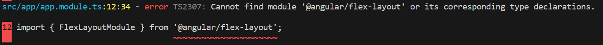
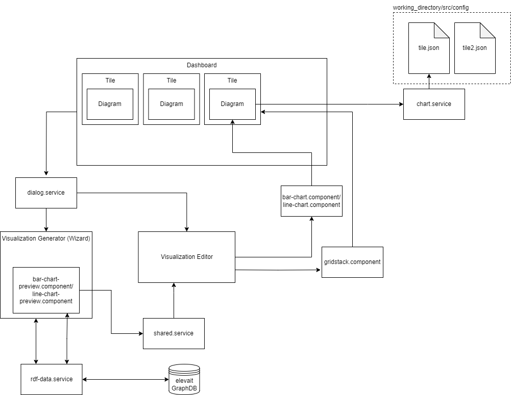
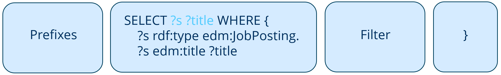
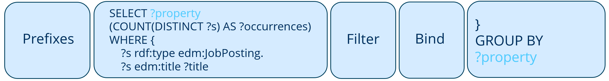
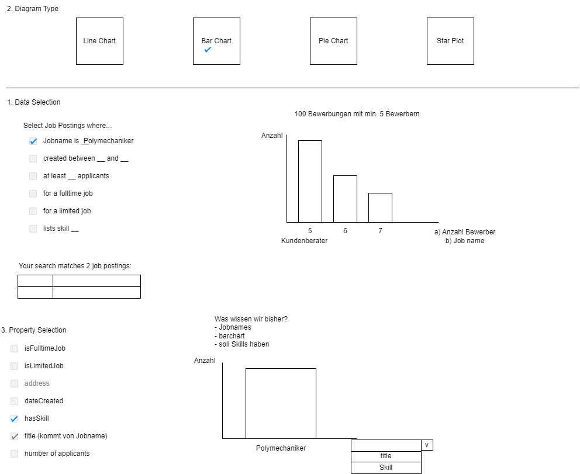

= End of Project Report
:toc: macro
:tocLevels: 2

[options="", cols="2h, 6"]
|===
|Project title
|Dashboard for Semantic Data 

|Term
|Winter term 2023/24

|Participants
|Zhiwei Zhan, Undine Stelter

|Supervision
|Dr.-Ing. Annett Mitschick, Dr.-Ing. Tom Horak, Sarah Alaghbari

|Course
|Team Project User Interface Engineering [KPUIE]
|===

toc::[]

== Introduction
Welcome to the conclusion of our project, where we aim to provide an overview of our project's structure, status and how it could be extended in the future. We decided to split this report off of the project description to make it easier to navigate, reference the project description and to have its own table of contents.

== Installation Instructions
Firstly, install Node.js, npm and Angular at the following versions:

- Node.js 14.17.5  (https://nodejs.org/en/blog/release/v14.17.5)
- npm 6.14.14 (should be included in Node.js)
- Angular 12.2.18  (`npm install -g @angular/cli@12.2.18`)

The next step is cloning and setting up the repository:

- Clone the repository
- Execute `npm install`

Then you can launch the application:

- `ng serve`
- Open `localhost:4200` in your browser of choice

Alternatively, you can use `ng serve -o` to open a new browser tab directly

=== Troubleshooting
One issues we came across multiple times when installing the project was npm not installing Angular's `flex_layout` component, causing the following error:

The workaround we found was to manually paste the `flex_layout` folder into `node_modules/@angular`. We have provided a zipped copy of our working `flex_layout` folder under `/doc`.

== Dependencies
All dependencies can be found in `package.json`, but the main ones and their versions are:

- bootstrap: 5.3.2
- chart.js: 4.4.0
- d3: 5.16.0
- gridstack.js: 4.2.6

== Top-Level Architecture

== Structure and contents of the /src folder
=== config 
Standard folder for saving/loading diagram config files

=== assets 
- All images, like the visualization select images in the Visualization Generator
- A text file with all job names, used for the suggestions on the job name input (lists like this can be used to add suggestions to fields where you can't use the raw values, like the title field in our case)

=== app
==== diagram
The main focus are the `bar-chart` and `line-chart` subfolders, the rest are essentially deprecated. 
(The `doughnut` and `star-plot` folders are responsible for generating examples with dummy data.)

These components generate the diagram on the Dashboard tile and determine the behavior of the tile's edit/save/inventory/delete buttons.

`copeChartAction()` is the most interesting method here, it creates the actual svg with the diagram in it, using d3.
The `dataSource` for generating the diagram is currently read from the browser's localStorage, which limits its scalability.

Going forward, the diagram components would greatly benefit from an abstract visualization.component to inherit from, as the calls to them via `chartAction` assumes a degree of interchangability between the diagram components and the edit/save/inventory/delete button functionality has a lot of duplications.

==== dialog
This folder contains all components for the various dialogs opened on top of the Dashboard, e.g. the Visualitation Generator, Editor and delete dialogs.

===== bar-chart-editor and line-chart-editor
- Dialog that is displayed after the Visualization Generator OR when the user clicks the edit button on a tile
- Allows user to set a title and the color of the bars/line
- Additionally the bar visibility in the bar-chart-editor
- Receives the data to generate a chart either from `shared.service` (if opened from the Visualization Generator) or the browser's localStorage (if opened from the Dashboard)
- Saves `visibiltyMapping` in localStorage (which encodes which of the data points get rendered, without modifying the underlying data source)
- Creates chart similar to `bar-chart.component`/`line-chart.component`

===== vis-gen-dialog
- Contains the Visualization Generator ("wizard")
- Preview section uses subcomponents `bar-chart-preview.component` and `line-chart-preview.component`
- Loads job name and skill suggestions into datalists objects to be used as suggestions for the text input fields (job names are fetched from `src/assets/job_name_suggestions.txt` and skills from `system.service`)
- `queryMappings` is used to add `FILTER` statements to the query, depending on the filters selected by the user
- Generates and executed the preview query
- Opens the Editor corresponding to the selected visualization type

===== bar-chart-preview and line-chart-preview
- Contain the mapping of user-selected properties to the x- and y-axis of the visualization
- Generate and execute the data query (with a special case for skills)
- Use the same `queryMappings` block as `vis-gen-dialog.component`
- Write their results to `shared.service` to be used in the Editor
- Similar to the diagram components, the preview components would benefit from more abstraction, like a shared interface or an abstract preview.component

==== gridstack
- Initializes the grids (major and minor/inventory)
- Generates the tiles to be displayed on program startup/page reload
- Handles chart actions (edit/save/inventory/delete)
- Contains the logic to allow tiles switching grids (e.g. by being dragged out of the minor/inventory grid into the major grid)

==== services
[options="header", cols="1, 5"]
|===
| Name              | Description
| chart.service     | Functionality for saving to/loading from json file and browser localStorage
| dialog.service    | Opens the delete dialogs (deleting single tile or all tiles), snackbars, and the different Editor dialogs
| gridstack.service | Handles the creation of new tiles and saving its size and position data
| icon.service      | Adds the title and edit/save/inventory/delete buttons to the Dashboard tiles
| rdf-data.service  | Communicates with SPARQL endpoint, stores prefixes needed for SPARQL queries
| shared.service    | Used for passing SPARQL query results between the preview component in the Visualization Generator to its corresponding Editor
| system.service    | Stores a (hand-written) list of all skillNames and their unique abbreviations
|===

== SPARQL Queries
=== Preview Query

The Preview Query is used to fetch the title (and subject URI) of all job postings that match the user's filters. The filters are encoded in SPARQL statements as follows:

[options="header", cols="1, 4"]
|===
| Property      | SPARQL statement
| jobName       | FILTER contains(?title, "jobName").
| createdBefore | ?s edm:dateCreated ?created. + 
FILTER (xsd:dateTime(“createdBeforeT00:00:00Z") > xsd:dateTime(?created)).
| createdAfter  | ?s edm:dateCreated ?created. + 
FILTER (xsd:dateTime(?created) > xsd:dateTime(“createdAfterT00:00:00Z")).
| fulltimeJob   | ?s mp:isFulltimeJob “fulltimeJob"^^xsd:boolean.
| limitedJob    | ?s mp:isLimitedJob “limitedJob"^^xsd:boolean.
| skill         | ?s edm:hasSkill ?skill. ?skill edm:textField ”skill"@de
|===

=== Data Query

The Data Query is used to count all occurrences of the property the user selected, while using the same filters as selected by the user. For the COUNT to work, we use additional BIND statements: 

[options="header", cols="1, 4"]
|===
| Property      | SPARQL statement
| jobName       | BIND("jobName" AS ?justJobName).
| fulltimeJob   | ?s mp:isFulltimeJob ?fulltimeJobRaw. + 
BIND(str(?fulltimeJobRaw) AS ?fulltimeJob).
| limitedJob    | ?s mp:isLimitedJob ?limitedJobRaw. + 
BIND(str(?limitedJobRaw) AS ?limitedJob).
| skill         | ?s edm:hasSkill ?skill. + 
?skill edm:textField ?skillName. + 
FILTER (lang(?skillName) = "de"). + 
FILTER (?skillName IN (skillListString)).
|===

`skillListString` is created by concatenating all skill names fetched by a different SPARQL query:

[source, sparql]
----
SELECT DISTINCT ?skillName
    WHERE {
    ?s rdf:type edm:JobPosting.
    ?s edm:title ?title.
    # filters as set by user
	?s edm:hasSkill ?skill.
    ?skill edm:textField ?skillName.
    FILTER (lang(?skillName) = "de").
}
ORDER BY ?skillName
----

== Workflows and GUI Screenshots
=== Adding a Visualization Tile
[cols="1, 1"]
|===
a| image::images/screenshots/start_screen.png[] | To add a visualization, click on "Click to create a diagram".
a| image::images/screenshots/wizard_open.png[] | Creating the visualization is done in the Visualization Generator. This example visualization will show all job postings, whose title contain the word "Fachperson" and which are for fulltime jobs.
a| image::images/screenshots/jobname_with_suggestions.png[] | The "Job name" and "Lists skill" input fields have suggestions. The user does not have to choose one of them though.
a| image::images/screenshots/fulltime_options.png[] | Boolean properties like "isFulltimeJob" have a dropdown menu with named options.
a| image::images/screenshots/preview.png[] | The user can preview a list of all job postings which match their filters by clicking the "Preview" button. In this case, there are 8 relevant job postings.
a| image::images/screenshots/external_link.png[] | Clicking on the blue link symbol next to the title of the job posting opens the information page of the job posting in a new tab.
a| image::images/screenshots/selected_linechart.png[] | The visualization type is chosen by clicking on one of the pictures.
a| image::images/screenshots/go_to_editor.png[] | After choosing the properties to visualize and their mapping, the user can click on "Forward to Editor" to proceed to the Editor. In the case of a line chart, the properties for both axes are hard-coded.
a| image::images/screenshots/editor_empty.png[] | Since the user selected a line chart, the line chart editor is loaded.
a| image::images/screenshots/named_linechart.png[] | Once the user inputs a title, the diagram is generated. In the bar chart Editor, the user additionally has to choose, which of the data points get rendered.
a| image::images/screenshots/choose_color.png[] | The user can choose the color of the line freely using a color picker.
a| image::images/screenshots/added_to_dashboard.png[] | By clicking "Add to Dashboard", a new tile gets added to the Dashboard and the Editor is closed.
|===

=== Editing an existing Tile
[cols="1, 1"]
|===
a| image::images/screenshots/added_to_dashboard.png[] | The Editor can be opened by clicking on the edit button.
a| image::images/screenshots/back_to_editor.png[] | The same Editor is shown as after the user completed the Visualization Generator. Note the absence of the "Back to Visualization Generator" button.
|===

=== Downloading and Uploading Tiles
[cols="1, 1"]
|===
a| image::images/screenshots/added_to_dashboard.png[] | To download a tile's config file, click on the download button.
a| image::images/screenshots/downloaded.png[] | The location of the downloaded file depends on the browser settings.
a| image::images/screenshots/delete.png[] | The user can now safely delete a tile by clicking on the delete button and confirming.
a| image::images/screenshots/start_screen.png[] | The tile is now deleted.
a| image::images/screenshots/load_from_local.png[] | To restore the tile from its config file, click on "Load a diagram from local" and select the file to be loaded in the opened file browser.
a| image::images/screenshots/added_to_dashboard.png[] | The tile is now restored.
|===

=== The Inventory System
[cols="1, 1"]
|===
a| image::images/screenshots/added_to_dashboard.png[] | To add a tile to the inventory system, click on the heart button. 
a| image::images/screenshots/favorited.png[] | This will cause the heart to change color to red.
a| image::images/screenshots/in_inventory.png[] | The inventory can be opened by clicking on "Show diagrams in inventory". A copy of the tile has been placed in the inventory system.
a| image::images/screenshots/unfavorited.png[] | The tile can be removed from the inventory system by clicking the red heart button on either the original tile or the "copied" tile in the inventory.
|===

=== Deleting all Tiles
[cols="1, 1"]
|===
a| image::images/screenshots/added_to_dashboard.png[] | To delete all tiles, click on "Click to remove ALL widgets".
a| image::images/screenshots/delete_all.png[] | Confirm in the opened dialog.
a| image::images/screenshots/start_screen.png[] | All tiles are now deleted.
|===

== Project Status based on Requirements
In this section, we want to go over the functional requirements and briefly evaluate, how well we think the projects fulfills the requirements and which points might still be open.

=== Functional Requirements

[options="header", cols="1h, 4, 4"]
|===
|ID
|Description
|Status

|[[FR0010]]<<FR0010>>
a|
The user is able to choose out of four visualization types for each visualization the application generates. The visualization types are picked from the categories Evolution, Ranking and Part of a whole.
|We implemented two out of four visualization types, due to time reasons and us only being two people.

|[[FR0011]]<<FR0011>>
a|
The user is able to select which instance data is used to generate visualizations (<<FR0010>>).
|We focused only on JobPostingShapes, the user is not able to choose a different shape.

|[[FR0012]]<<FR0012>>
a|
The user is able to filter the instance data which is used to to generate visualizations (<<FR0010>>) by limiting the domain, e.g. by specifying a time frame for the data.
|The user can filter by job name, time, included skills, parttime/fulltime jobs and limited/unlimited jobs.

|[[FR0013]]<<FR0013>>
a|
The user is able to customize the color scheme mapped onto the data when generating visualizations (<<FR0010>>).
|The user can choose a main color for the bars in a bar chart and the line in a line chart. We did not implement a visualization type like a pie chart that necessitates choosing a color palette/multiple colors.

|[[FR0014]]<<FR0014>>
a|
The user is able to filter the instance data used to generate visualizations (<<FR0010>>) by selecting attributes, values or relationships from a list generated by the application.
|Steps 3 and 4 of the Visualization Generator allow the user to choose attributes to visualize and their assignment to the visualization axes in a limited fashion. In a bar chart, the user can choose which attribute to map to the x-axis. For line charts, the x-axis is hard-coded to use the job posting's creation date and the y-axis is hard-coded to be the number of job postings per day.

|[[FR0015]]<<FR0015>>
a|
The user is able to toggle the visibility of different values, e.g. displaying only certain skills out of a list of skills.
|In a bar chart, the user can toggle the visibility of each bar.

|[[FR0020]]<<FR0020>>
a|
The app contains a Dashboard, with each user-generated visualization being represented by a tile. The application supports up to 20 tiles at once without crashes. The number of tiles the user can generate is not limited.
|Done.

|[[FR0021]]<<FR0021>>
a|
The user is able to arrange the tiles representing visualizations (<<FR0020>>) freely on the Dashboard using a drag-and-drop system.
|Done, with the note that moving the tiles is done in unit-steps.

|[[FR0022]]<<FR0022>>
a|
The Dashboard tiles can be resized freely by the user, in unit steps. The minimum tile size depends on the visualization type.
|Done, with the note that resizing the tiles is done in unit-steps. The minimum tile size is the same for both visualization types.

|[[FR0023]]<<FR0023>>
a|
Each visualizations on the Dashboard incorporates labels appropriate for the visualization type, e.g. axis labels and color keys.
|The visualizations currently only include axis labels in the form of values along the axes.

|[[FR0024]]<<FR0024>>
a|
The user is able to delete visualizations by deleting the tile containing them.
|Done.

|[[FR0030]]<<FR0030>>
a|
The application communicates with the SPARQL endpoint of an existing GraphDB database via premade SPARQL queries that are then configured by the user.
|Done, with the note that the SPARQL queries consist of premade statements that are altered and concatenated based on the user's input.

|[[FR0040]]<<FR0040>>
a|
The application supports user interaction via both mouse and keyboard inputs, enabling users to navigate and select options using the mouse, while allowing text and numerical data entry through keyboard input in designated fields.
|Done.

|[[FR0041]]<<FR0041>>
a|
The application's display language is English.
|Done.
|===

==== Optional Functional Requirements
[options="header", cols="1h, 4, 4"]
|===
|ID
|Description
|Status

|[[FO0010]]<<FO0010>>
a|
The user is able to add totals and additive values when generating visualizations (<<FR0014>>).
|Not done.

|[[FO0011]]<<FO0011>>
a|
The user is able to define groups of values when generating visualizations (<<FR0014>>).
|Not done.

|[[FO0012]]<<FO0012>>
a|
The user is able to give custon titles to generated visualizations.
|Done.

|[[FO0013]]<<FO0013>>
a|
The user is able to "stash" visualizations that are not needed at the moment, without having to delete them.
|Done via the inventory system. Visualizations can be stored there and retrieved later by the user.

|[[FO0014]]<<FO0014>>
a|
The user is able to download visualizations or the means to re-generate them as a file. Such files can be uploaded into the program to re-generate the visualizations. Visualizations can be shared between users by sharing these files (e.g. via Email).
|Done via the download button on the visualization tiles and the "Load a diagram from local" button on the Dashboard.

|[[FO0015]]<<FO0015>>
a|
The user is able to interact with visualizations, e.g. adjust the portrayed time frame. These adjustments may alter the SPARQL query underlying the visualization. This does not include interaction between visualizations, e.g. brushing and linking techniques.
|Not done.

|[[FO0016]]<<FO0016>>
a|
The user is able to lock the aspect ratio of a particular tile to prevent accidental resizing.
|Not done.

|[[FO0017]]<<FO0017>>
a|
The application offers the user guidance for selecting the data to be visualized (<<FR0012>>, <<FR0014>>), e.g. by displaying lists of available attributes for the user to select some or by displaying counts of instances affected by a filter.
|Partially done via the job name and skill suggestions, as well as the preview section of the Visualization Generator's first step.

|[[FO0020]]<<FO0020>>
a|
The application's support for mouse and keyboard (<<FR0040>>) is extended by touchscreen support.
|We tested and used the application using a touchscreen. For better touchscreen support, it would be beneficial to increase the size of the Dashboard tile buttons and the bar chart Editor's bar visibility checkboxes.

|[[FO0021]]<<FO0021>>
a|
The application additionally offers German as a display language, with a switch to toggle between languages.
|Not done.
|===

== Known Bugs
- When dragging a line chart tile out of the inventory system, to a main grid that contains a different line chart tile, it sometimes "merges" the two tiles. This might be due to the line chart's line getting added to the svg after the data points.
- When deleting all tiles, there is a TypeError in the browser console
- The user can choose bar chart as a visualization type, but not add any filters, which results in a dataSource that the program cannot generate a diagram from. The only bar option that shows up is "undefined".
- A dataSource with a lot of entries (a lot of job postings) sometimes creates very flat diagrams in the bar chart Editor.

== Future Extensions
- Adding pie chart and star plot as visualization types. Star plots likely need a different data set to work with, since the job postings did not have attributes that lend themselves well to being visualized in a star plot.
- More abstraction in the code, especially in the form of abstract editor and preview components
- Add support for different data sets, not just job postings
- (Semi-)Automate the process of generating filter options in the Visualization Generator from a shape definition
- Add more customization options to the Editor, e.g. Adding average/minimum/maximum values or grouping values
- Tile Interaction, as written about in the Project Description V2
- More user guidance/feedback in the Visualization Generator, e.g. dynamically greying out filter options if they wouldn't have a filtering effect or a live diagram preview in the preview section of the Visualization Generator
- The ability to set multiple values for filters (like multiple job names) and setting how the values work together (AND, OR, NOT, ...)
- Live data support/multiple tile types, e.g. archive tiles that store their data inside their config file and provide a snapshot of the current database state versus live tiles that periodically run the same query and update themselves

== Further Documentation
- Undine's Obsidian vault, saved under `doc/KP_UIE.zip`
- The shape definitions Tom sent us: `shape.ttl`
- UI layout concept for the Visualization Generator:

